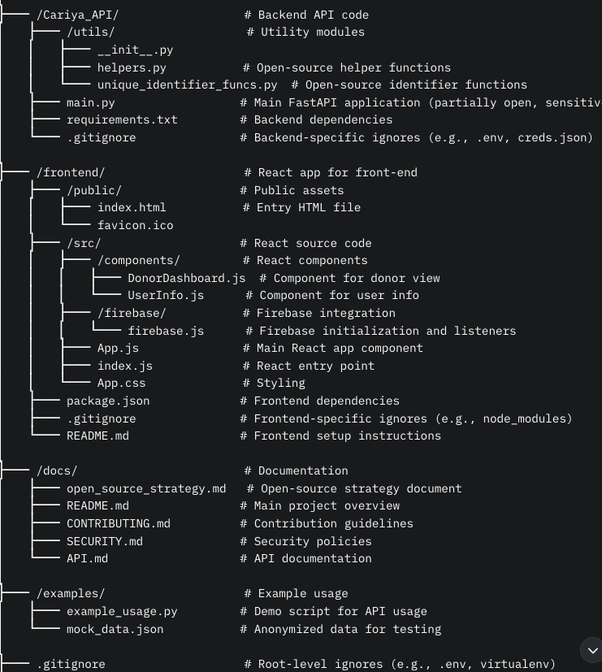

# Cariya Wallet Open Source Contribution Strategy

Welcome to the Cariya Wallet Open Source Repository. This document outlines our strategy for open-source contributions, detailing what components are shared, how we maintain security and privacy, and our licensing approach.

---

## 🌐 Overview

As part of our initiative to promote transparency and community collaboration, Cariya Wallet is partially open-sourced. This allows developers to contribute to reusable and secure components of the system while keeping user data and sensitive business logic private.

---

## 🧩 Components Made Open Source

We are sharing the following components for the benefit of the community:

### ✅ Open-Source Eligible Components

- **Helper Functions** (`utils/helpers.py`)  
  - Includes: `calculate_expected_savings`, `update_activity_points`, `segment_users_and_analyze_trends`  
  - 📌 *Reusable logic for financial tracking and analytics, safe to share*

- **Unique Identifier Generation** (`utils/unique_identifier_funcs.py`)  
  - Includes: `generate_unique_identifier`, `normalize_mobile_number`, `parse_children_ages`  
  - 📌 *Generic utilities valuable for identity management*

- **Front-End Templates and Scripts**  
  - Includes: HTML donor dashboard, real-time JavaScript update example  
  - 📌 *Client-side components useful for UI/UX contributions*

- **API Documentation and Sample Endpoints**  
  - Includes: OpenAPI (Swagger) specs, endpoint stubs (e.g., `/segment-users`)  
  - 📌 *Facilitates external tool development and integration*

---

### 🚫 Components Kept Private

- **Main Application Logic** (`main.py`)  
  - Interacts directly with Firestore and handles sensitive routes

- **Firebase Credentials and Configurations**  
  - Includes API keys and database access information

- **Data Models with PII**  
  - E.g., mobile numbers, children's ages, birth order

---

## 🔐 Security & Privacy Measures

To safeguard user data while allowing community participation, we apply these principles:

### 🔒 Data Isolation

- Keep sensitive code in a private repository or modular boundary
- Use environment variables for secrets (excluded from Git)

### 🔍 Code Review & Auditing

- Require **2 maintainer reviews** for all PRs
- Use security tools like **Snyk** or **Dependabot**

### 🛑 Access Control

- Only trusted maintainers have write access
- Use GitHub branch protections (tests, code review)

### 📜 Privacy by Design

- No PII-handling in open-source code
- Only test with mock or anonymized datasets

### 📦 Dependency Management

- Lock all dependencies using `requirements.txt` or equivalent
- Monitor for security vulnerabilities

### 📚 Contributor Education

- Contribution guidelines include security/privacy expectations
- Documentation highlights what can and cannot be exposed

---

## ⚖️ Recommended License

We have adopted the **MIT License** for this repository.

### Why MIT?

- ✅ **Permissive**: Use in both open-source and commercial projects
- ✅ **Simple**: Minimal legal overhead for contributors and users
- ✅ **Compatible**: Works well with Apache, GPL, and other licenses
- ✅ **Control Retention**: Maintains author attribution

### Alternatives Considered

- **Apache 2.0**: Too verbose for our needs
- **GPL v3**: Too restrictive for our partial open-source model

---

## 🤝 Contributing

We welcome contributions that respect our privacy and security boundaries.  
Please read the [CONTRIBUTING.md](CONTRIBUTING.md) (coming soon) before submitting pull requests.

---

## 📫 Contact

For questions or partnership inquiries, reach out to the core team via [email@example.com].

---
